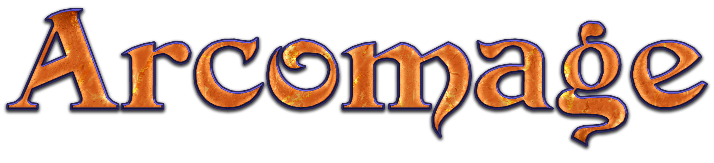

# Arcomage fan-remake made on Godot Engine

## Description
#### Loved by many card mini-game from Might and Magic 7 and 8 returns with updated graphics as standalone game!
Arcomage is a computer card game for two players. Each player has a random set of 6 cards, a tower, a wall, three types of resources and their generators.

**Resources:**
* bricks
* gems
* recruits

**Resource generators (respectively):**
* quarry
* magic
* dungeon

At the beginning of each turn, the generators increase the amount of the player's corresponding resources by the current levels of these generators. Each turn a player must use or discard one of his cards. To use the card, a certain amount of one of the resources is required. After using the card, it performs a combination of some actions and instead of it the player is randomly given another. Further, if the card does not prescribe otherwise, the move goes to the other player.

**Card actions:**
* causing damage to the wall and/or tower (enemy or both the enemy and his own)
* changing the amount of resources or the levels of their generators in oneself and/or the enemy
* increasing your own wall and/or tower

**The rules of the game allow victory in any of the following ways:**
* building your tower to the required minimum
* accumulation of any resource to the required minimum
* destruction of the enemy tower

As a rule, cards that require the same type of resources are similar in action. Gems - increase the tower, bricks - walls, animals - to deal damage to the enemy. The damage can be directed specifically at a tower or wall, or be of a general nature. In the second case, the wall takes the damage first, then the tower.

## Requirements
* **GPU:** OpenGL 2.1 support

## Compilation and editing
* [**Godot** v.3.3.2 stable](https://downloads.tuxfamily.org/godotengine/3.3.2/)
* [**CastleDB** v.1.5](http://castledb.org/)